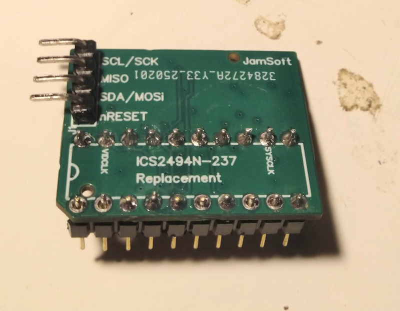
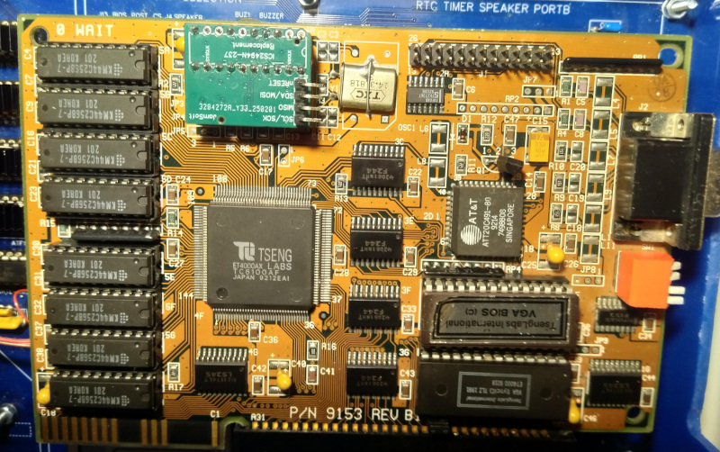
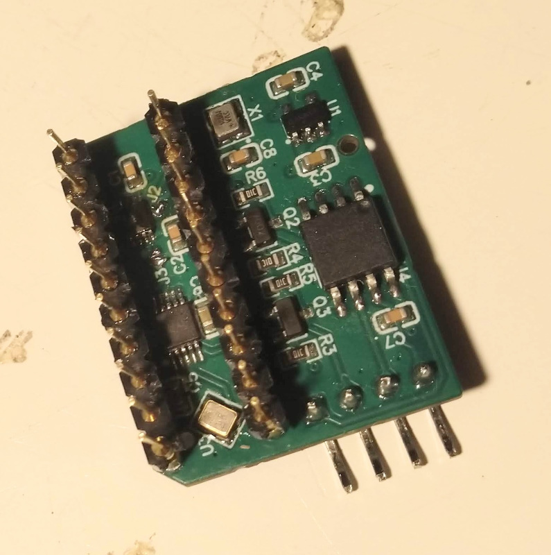

# ICS2494 / AV9194 Video Clock Generator Replacement

This is a simple device that can replace the ICS2494 / AV9194 Clock Generator chips used on some VGA Graphics cards.



It is based on the Skyworks Si5351A and Atmel ATTiny85 microcontroller

I decided to develop this after getting a TsengLabs ET4000AX based card with a faulty ICS2494-259 chip on it. I was struggling to find replacement chips that were an exact match for this VGA card and I was also interested in learning how to develop for microcontrollers and learn some C, so thought I would see if I could create my own replacement clock generator chip.



I was inspired by the [Project: Full Can Clock Oscillator Replacement](https://www.vogons.org/viewtopic.php?t=82731) on Vogons and had also been signposted to the [Adafruit Si5351 Clock Generator Breakout](https://learn.adafruit.com/adafruit-si5351-clock-generator-breakout/overview) boards by folks on the [RHD Discord](https://discord.gg/BYYP887H) server.


## Limitations

I developed it to fix my ET4000AX card, so it only supports the features that card used, so the following limitations apply:

1. Only 8 Video Clocks (VIDCLK) can be supported - these use the lower 3 CS lines: CS0, CS1 and CS2. CS3 is ignored and on my ET4000AX card was hard-wired high so only supported clocks 8 to F on the [AV9194 datasheet](/docs/AV9194_AV90C94_199206.pdf).
2. System Clock is fixed - can't select from the 3 system clocks from the datasheet. Again this was how my ET4000AX card was setup, only 1 SYSCLK was available. I use an oscillator to provide the system clock, but there are jumper pads on the board to redirect Clock 1 of the Si5351 to this pin instead. (see Further Development)


## Hardware

I tried to keep the board as small as possible to allow for easy fitting to the VGA card, but I couldn't quite get it to a DIP20 footprint.



I had these made up my JLCPCB with some of the basic parts populated. I think I had to get the ATTiny85, Si5351 and the crystal & oscilator seperatly to add myself. It is hard to work on as it does use very small SMD footprints, but you might be able to get them fully populated from PCB manufacturer.


## Clock Configuration

I used an old version of the ClockBuilder Pro that I could run easily on WINE to help me understand what the
registers of the Si5351A should be programmed to by the ATTiny85. Once I'd configured the clocks based on the AV9194 datasheet, I exported the .h header files and copied the reg addr + value pairs to the si5351a_registers.h header file. This could be modified to get any set the clock frequencies required by a particular video card chip.


## Building

I'm very new to C coding, so my Makefiles and code are a bit of a mess, but they work for me on my Linux laptop.

Project uses:
- [avr-gcc](https://gcc.gnu.org/wiki/avr-gcc) to build
- [avrdude](https://github.com/avrdudes/avrdude) to program
- [simavr](https://github.com/buserror/simavr) to do basic simulation

To build:
1. Clone the repo
2. Go into the 'firmware' directory
2. Run ```make``` and hopefully it works?! (if not, sorry and please poke around the Makefile to see what I was trying to do...)

It will also generate a listing file (.lst) which may be helpful for debugging.


## Simulating

This doesn't work very well as the current versions of [simavr](https://github.com/buserror/simavr) only have SPI (three-wire) support in the USI module on the ATTiny85 core. I tried adding I2C (two-wire/TWI) support, but I don't have enough knowledge of the simulator or I2C to make this work and I was just getting bogged down, so abandoned that effort.

To run:
1. Clone simavr repo and put next to this repo
2. Enter the 'sim' directory
3. Run ```make```
4. Enter the 'firmware' directory
5. Run ```make debug``` - this will make the .axf binary with debugging symbols
6. Run ```./sim/ics2494-replacement-board.elf``` to start the simulator
7. Run ```make run``` from 'firmware' to run it in avr-gdb


## Programming

I use a FT232H board connected via the SPI pins on the ATTiny85. However, any [programmer that is supported by avrdude](https://avrdudes.github.io/avrdude/7.3/avrdude_4.html#:~:text=programmer-id) shoudl work. I had issues with a cheap FT232RL board I got from AliExpress, but it turned out to be a fake, so putting it down to that. 

The programming pins are broken out to the 4pin header on the top, but +5V and GND are on the DIP socket pins, mapping is:

| ICS Replacement | FT232H pin     | 
| --------------- | -------------- |
| 1 nRESET        | AD3            | 
| 2 SDA/MOSI      | AD1            |
| 3 MISO          | AD2            |
| 4 SCL/SCK       | AD0            |
| 5 +5V (DIP20)   | +5V            |
| 6 GND (DIP10)   | GND            |


## Further Development

As the Si5351 has 3 clock outputs I tried using one of the channels for the SYSCLK which would save needing the 40/50/56 MHz oscillator. However the reference proceedure for changing the VIDCLK also needs to stop the SYSCLK and that was causing some weirdness (blank screen, wrong colours, etc...) - probably as the PC was trying to write to the ET4000AX and things were getting lost. Could look at changing the code to see if there is a way to keep the SYSCLK running whilst the VIDCLK is changed (maybe using seperate PLLs for each?).

## Disclaimer

This is provided as-is without any guarantees it will work for you or your project project. I'm just sharing what I did to help others with their own projects and take no responsibility for any damage caused by the use of this code.
